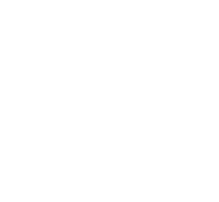

#  Sonic Surgeon

[Play here →](https://tom-gilbertsons-lab.github.io/sonic-surgeon/)

**Educational minigame showcasing non invasive neurosurgery for movement disorders.**

Plan and perform (bilateral) MRgFUS vim thalamotomy for essential tremor.\
Suitable for outreach events/ educational purposes (there are no difficulty levels and the game is very easy to beat).

## Description
We've built this to take to the Royal Society Summer Science Exhibition 2025; as contributers to one of the main exhibits;  <a  href="https://doi.org/10.1038/ncomms12327"  target="_blank">Focused Ultrasound, Extraordinary Energy</a>.

## Help
Feel free to contact [@i-brnrd](https://github.com/i-brnrd) on here or via [University of Dundee](https://www.dundee.ac.uk/people/isla-barnard).

## Authors
[Isla Barnard](https://i-brnrd.github.io) (developer, art & original concept)\
Graeme MacKenzie\
Sadaquate Khan\
[Tom Gilbertson](https://tom-gilbertsons-lab.github.io) (original concept, lead)

## Citation
\
If you use this, please consider citing this repo (note the DOI resolves to the latest version:)

## Acknowledgments
To everyone who helped test this.\
Most importantly to [Professor Sandy Cochran](https://www.gla.ac.uk/schools/engineering/staff/sandycochran/) for leading the bid to take <a  href="https://doi.org/10.1038/ncomms12327"  target="_blank">Focused Ultrasound, Extraordinary Energy</a> to the [Royal Society Summer Science Exhibition](https://royalsociety.org/science-events-and-lectures/summer-science-exhibition/)

## License (MIT)
See [here](/LICENSE)
